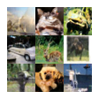
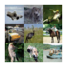
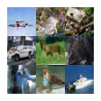
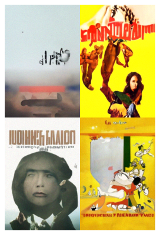
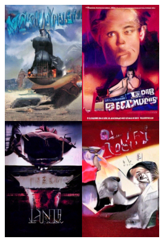
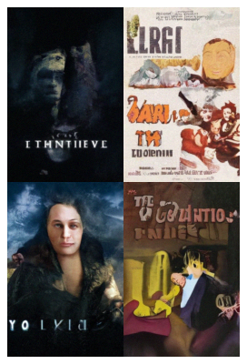

# Movie Diffusion
By: Anton Forsman, Carlos Marí, Tim Olsen

Implementation of a diffusion model to generate movie posters.

Model checkpoint can be found at https://huggingface.co/anforsm/movie-diffusion/

## Sample outputs

### CIFAR-10 Class conditional sampling
In a 3x3 collage, each row and column is a different class. Same across collages.

### Movie posters 
These are 2x2 collages of movie posters.

### Inpainting
These are posters which have been inpainted in different ways.

